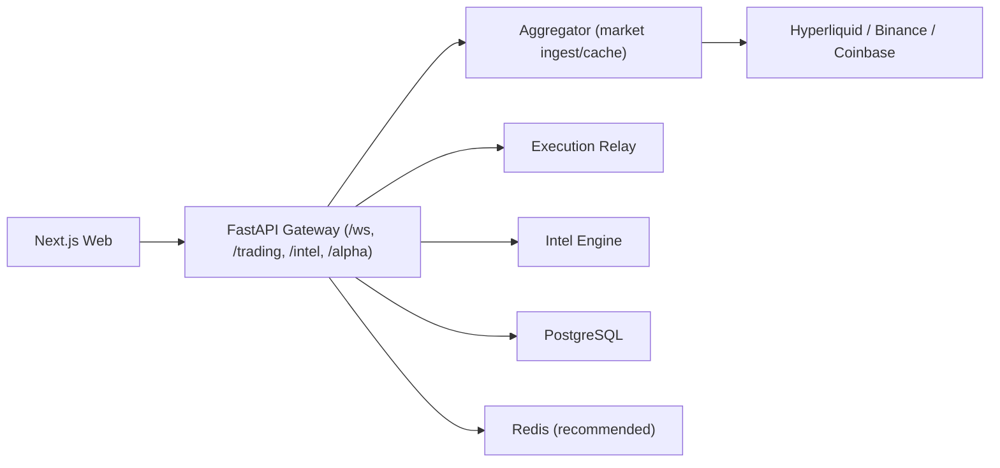

# HyperSentry Deployment Guide

Last updated: February 14, 2026  
Aligned with: `/Users/sunnyjain/Desktop/hypersentry/architecture.md`

## 1) Deployment Goals

- Keep current codebase running while moving toward production architecture.
- Maintain low-latency market UX with explicit stale handling.
- Separate public and private realtime channels securely.
- Survive exchange rate limits and partial source outages.

## 2) Supported Topologies

### Stage 1 (Current, Recommended Immediately)

Single backend process with hardened boundaries:

- API/WS gateway
- market ingest (`aggregator`)
- alpha engine
- execution relay

Use this while scaling safely and validating contracts.

### Stage 2 (Next)

Split into two backend services:

- Service A: `market-ingest` (venue WS + normalization + hot cache updates)
- Service B: `gateway-execution` (REST/WS + auth + execution + private fanout)

### Stage 3 (Scale)

Introduce message bus and shared hot store:

- ingest publishes normalized events
- compute/alpha consumes events
- gateway serves from Redis snapshots + private execution events

## 3) Runtime Components



## 4) Environment Matrix

- `local`: docker-compose or direct local processes
- `staging`: production-like infra, paper-trading mode
- `production`: hardened auth, strict CORS, private channel enforcement

## 5) Process Startup Commands

### Backend (required)

From `/Users/sunnyjain/Desktop/hypersentry/backend`:

```bash
./venv/bin/python -m uvicorn main:app --host 0.0.0.0 --port 8000
```

Development hot reload:

```bash
./venv/bin/python -m uvicorn main:app --host 0.0.0.0 --port 8000 --reload
```

### Frontend

From `/Users/sunnyjain/Desktop/hypersentry/web`:

```bash
npm run dev
```

## 6) Required Environment Variables

### Backend core and auth

| Variable | Required | Notes |
|---|---|---|
| `ENVIRONMENT` | yes | `development` or `production` |
| `JWT_SECRET_KEY` | yes | strong random secret |
| `SESSION_EXPIRE_HOURS` | recommended | default 168 |
| `ALLOWED_ORIGINS` | yes (prod) | comma-separated frontend origins |
| `FRONTEND_URL` | yes (prod) | canonical frontend URL |

### Data and integrations

| Variable | Required | Notes |
|---|---|---|
| `DATABASE_URL` | yes (prod) | PostgreSQL DSN |
| `REDIS_URL` | recommended | shared cache/backpressure support |
| `GEMINI_API_KEY` | optional | intel enrichments |
| `TELEGRAM_BOT_TOKEN` | optional | alerting |
| `TELEGRAM_CHAT_ID` | optional | alerting |

### Trading and execution

| Variable | Required | Notes |
|---|---|---|
| `HL_ACCOUNT_ADDRESS` | required for live trading | account address |
| `HL_PRIVATE_KEY` | avoid long-lived usage | migrate to delegated signer/session model |
| `ENABLE_SERVER_SIDE_TRADING` | strongly recommended explicit | `false` by default in prod until controls validated |
| `REQUIRE_ADMIN_FOR_SERVER_TRADING` | recommended | keep `true` for guarded rollout |

### Performance/rate-limit tuning

| Variable | Default | Notes |
|---|---|---|
| `TRADING_TOKENS_CACHE_SEC` | `20.0` | metadata cache |
| `TRADING_PREFER_AGGREGATOR_MARKET_DATA` | `true` | serve tokens/prices from aggregator cache before HL REST |
| `TRADING_PRICES_CACHE_SEC` | `2.0` | prices cache |
| `TRADING_ORDERBOOK_CACHE_SEC` | `2.0` | snapshot cache |
| `TRADING_ORDERBOOK_UPSTREAM_MIN_SEC` | `5.0` | upstream snapshot floor |
| `TRADING_ORDERBOOK_AGG_FRESH_SEC` | `3.0` | freshness gate |
| `TRADING_ORDERBOOK_AGG_BACKOFF_SEC` | `45.0` | suppress snapshot fallback while aggregator upstream is rate-limited |
| `TRADING_ACCOUNT_CACHE_SEC` | `5.0` | account cache |
| `TRADING_OPEN_ORDERS_CACHE_SEC` | `5.0` | open orders cache |
| `TRADING_CANDLES_CACHE_SEC` | `2.5` | candles cache |
| `TRADING_WARN_THROTTLE_SEC` | `30.0` | throttle repeat rate-limit warnings |
| `AGGREGATOR_MAX_SUBSCRIPTIONS` | `80` | cap live symbols |
| `AGGREGATOR_AUTO_SUBSCRIBE_TOP_N` | `15` | warm symbols |
| `AGGREGATOR_SUBSCRIBE_BATCH_SIZE` | `3` | subscription burst size |
| `AGGREGATOR_SUBSCRIBE_BATCH_PAUSE_SEC` | `0.10` | burst pause |
| `AGGREGATOR_EXTERNAL_ENABLE` | `true` | external CVD/OI enrich |
| `AGGREGATOR_EXTERNAL_POLL_SEC` | `4` | enrich poll interval |
| `AGGREGATOR_OI_HL_WEIGHT` | `0.65` | OI composite weight |
| `AGGREGATOR_OI_BINANCE_WEIGHT` | `0.35` | OI composite weight |
| `AGGREGATOR_CVD_BINANCE_WEIGHT` | `0.70` | spot CVD weight |
| `AGGREGATOR_CVD_COINBASE_WEIGHT` | `0.30` | spot CVD weight |
| `WHALE_TRACKER_COUNT` | `20` | top wallets to track (higher values add HL load) |
| `WHALE_POLL_INTERVAL` | `60` | whale scan interval seconds |

### Event bus backend (migration bridge)

| Variable | Default | Notes |
|---|---|---|
| `EVENT_BUS_BACKEND` | `inproc` | `inproc` or `kafka` |
| `EVENT_BUS_KAFKA_BOOTSTRAP_SERVERS` | empty | comma-separated brokers |
| `EVENT_BUS_KAFKA_TOPIC` | `hypersentry.events` | bus topic name |
| `EVENT_BUS_KAFKA_CLIENT_ID` | `hypersentry-event-bus` | producer client id |
| `EVENT_BUS_KAFKA_COMPRESSION` | `lz4` | compression type |
| `EVENT_BUS_KAFKA_ACKS` | `all` | producer acks |
| `EVENT_RELAY_SOURCE` | `inproc` | `inproc` or `kafka` |
| `EVENT_RELAY_KAFKA_GROUP_ID` | `hypersentry-event-relay` | consumer group for API relay |

Kafka backend dependency:

- Install `aiokafka` in backend runtime when using `EVENT_BUS_BACKEND=kafka`.
- If unavailable, backend safely falls back to in-process fanout and logs a warning.

### Frontend

| Variable | Required | Notes |
|---|---|---|
| `NEXT_PUBLIC_API_URL` | yes | backend base URL |
| `NEXT_PUBLIC_WS_URL` | recommended | explicit WS endpoint (for alpha hooks) |
| `NEXT_PUBLIC_WALLET_CONNECT_PROJECT_ID` | yes for wallet UX | wallet connect |

## 7) Public vs Private Stream Deployment Rules

- Keep market/alpha telemetry on public channels.
- Keep account/order/fill/risk payloads on authenticated private channels.
- Enforce token validation before private subscription.
- Ensure no private payload is emitted without `user_id` binding.

## 8) Network and Proxy Requirements

- Enable WebSocket upgrade (`Connection: upgrade`, `Upgrade: websocket`).
- Configure idle timeouts > 60s for WS paths.
- Use sticky sessions if running multiple gateway instances without shared WS session store.
- Expose backend on port `8000`; frontend on port `3000`.

## 9) CORS and Origin Policy

- In production, set explicit origins in `ALLOWED_ORIGINS`.
- Do not use wildcard origins with credentialed auth.
- Keep frontend and backend canonical URLs aligned with `FRONTEND_URL` and `NEXT_PUBLIC_API_URL`.

## 10) Deployment Options

### Option A: Managed stack

- Frontend: Vercel
- Backend: Koyeb/Render/Fly/Railway paid tier
- Database: Neon/Postgres service
- Redis: Upstash/managed Redis

### Option B: Self-hosted containers

- Use `/Users/sunnyjain/Desktop/hypersentry/docker-compose.yml` for local baseline.
- For production, deploy separate containers/services for frontend, backend, postgres, redis.

## 11) Release Procedure

1. Deploy backend first with trading disabled:
   - `ENABLE_SERVER_SIDE_TRADING=false`
2. Run smoke checks (section 12).
3. Deploy frontend with updated API URL.
4. Validate public WS flow and stale markers.
5. Enable guarded execution path for admin users only:
   - `ENABLE_SERVER_SIDE_TRADING=true`
   - `REQUIRE_ADMIN_FOR_SERVER_TRADING=true`
6. Expand execution access only after error budget and audit checks pass.

## 12) Post-Deploy Smoke Checks

Backend health and contracts:

```bash
curl -s http://<backend-host>:8000/aggregator/status | jq
curl -s "http://<backend-host>:8000/aggregator/symbols?mode=default&limit=25" | jq
curl -s "http://<backend-host>:8000/trading/orderbook?coin=BTC&depth=40" | jq
curl -s http://<backend-host>:8000/intel/latest | jq
```

Expected checks:

- `/aggregator/status` reports running and non-empty subscriptions.
- `/trading/orderbook` returns `source`, `book_ts`, and non-empty `book` in normal conditions.
- Frontend connects to `/ws` and receives typed updates (`agg_update`, etc).
- Private actions remain blocked without authenticated session.

## 13) Observability Baseline

Track and alert on:

- WS connected clients
- WS broadcast failures and disconnect rates
- orderbook freshness age (`book_ts` lag)
- exchange 429 rates by endpoint
- alpha queue depth and dropped update count
- execution submit-to-ack latency

Log policy:

- Expected WS close paths should be `INFO/WARNING`, not spam `ERROR`.
- Include request/session/user correlation IDs wherever available.

## 14) Rollback Plan

If degradation is detected:

1. Disable live execution immediately:
   - `ENABLE_SERVER_SIDE_TRADING=false`
2. Keep read-only terminal and public data online.
3. Reduce aggregator load:
   - lower `AGGREGATOR_AUTO_SUBSCRIBE_TOP_N`
   - lower `AGGREGATOR_MAX_SUBSCRIPTIONS`
4. Increase cache TTLs temporarily to reduce upstream pressure.
5. Roll back to previous backend image/build and redeploy.

## 15) Migration Path (No Rewrite)

Near-term extraction sequence:

1. Stabilize event and WS contracts in current monolith.
2. Split market ingest (`aggregator`) into its own process/service.
3. Split execution relay into isolated service with stricter auth controls.
4. Introduce bus + shared hot store if/when needed for higher scale.

This path keeps delivery velocity high while progressively reducing architectural risk.
