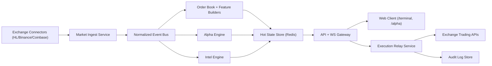
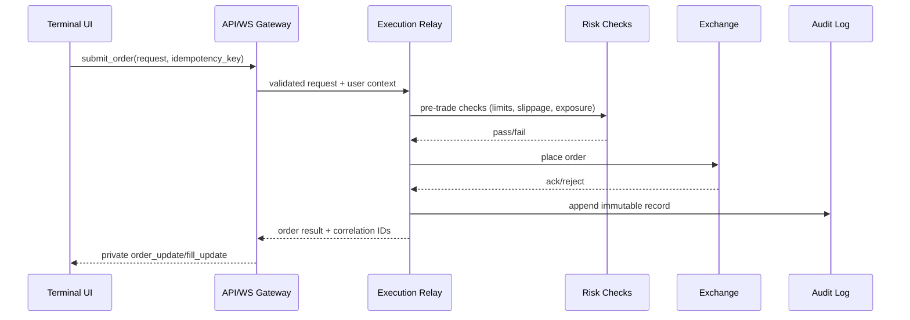

# HyperSentry Architecture (Low-Level Design)

Last updated: February 14, 2026

## 1) Objective

Build a production-grade crypto terminal with:

- Low latency (sub-second UI freshness for core market panels)
- High data correctness (deterministic pipelines, explicit freshness, auditability)
- Secure execution (wallet-authenticated user sessions and controlled trade relay)
- Horizontal scalability (many concurrent users without per-tab collapse)

This design assumes the current codebase remains the base and is evolved using extraction and hard boundaries, not a rewrite.

## 2) Scope and Non-Goals

In scope:

- Real-time market data, alpha decisioning, risk, execution relay, and WS fanout
- Public and private stream separation
- Reliability and rate-limit controls
- Observability and incident-friendly logging

Out of scope:

- Mobile app architecture
- Historical analytics warehouse redesign beyond minimal needs
- Strategy research methodology details

## 3) Current System (As-Is Boundaries)

Current modules map cleanly to future services:

- Market ingest and cache: `backend/src/services/aggregator.py`
- Alpha decision engine: `backend/src/alpha_engine/services/alpha_service.py`
- Intel/news providers: `backend/src/intel/`
- Execution/trader orchestration: `backend/src/manager.py`, `backend/src/execution.py`, `backend/src/client_wrapper.py`
- Delivery layer (HTTP + WS): `backend/src/routers/`, `backend/src/ws_manager.py`, `backend/main.py`
- Frontend runtime: `web/app/terminal/page.tsx`, `web/store/useMarketStore.ts`, `web/hooks/useWebSocket.ts`

Key current strength: end-to-end functionality exists.  
Key current risk: multiple concerns still share one process and one in-memory state plane.

## 4) Target Logical Architecture



Implementation note:

- Current code now uses an event-bus interface with `inproc` default and optional `kafka` backend.
- This keeps producer contracts stable while enabling gradual migration to external bus infrastructure.

### Service roles

1. Market Ingest Service
- Maintains venue WebSocket sessions
- Normalizes venue payloads into canonical events
- Tracks source freshness, sequence, and health

2. Feature Builder Layer
- Maintains canonical order books and derived metrics
- Computes CVD/OI composites from configured venues
- Publishes snapshots and incremental deltas

3. Alpha Engine
- Consumes normalized market state
- Emits `alpha_conviction`, `gov_update`, `exec_plan`
- Computes and publishes execution intent; order submission is handled by execution pathways
  (`/trading/order`, execution relay, or autonomous client executor), not by alpha signal math itself.

4. API + WS Gateway
- Public APIs and public market WS stream
- Private authenticated WS stream for account/execution events
- Read-through cache and fallback logic

5. Execution Relay
- Authenticated trade execution only
- Idempotent order submission and state transitions
- Emits private `execution_event` and `fill_event`

6. Audit and Telemetry
- Immutable execution audit records
- Metrics, traces, and structured logs

## 5) Data Plane Separation

Design decision:

- Public stream: globally broadcastable market and alpha telemetry
- Private stream: per-user account, orders, fills, and sensitive risk state

### Public WS payload types

- `agg_update`
- `alpha_conviction`
- `gov_update`
- `intel_update` (if non-sensitive)

### Private WS payload types

- `exec_plan` (user-specific actionable plan view)
- `execution_event`
- `order_update`
- `fill_update`
- `account_update`
- `risk_update`

Rule:

- Private payloads must never be sent without authenticated context binding to `user_id`.

## 6) Canonical Event Envelope

All internal events use a shared envelope:

```json
{
  "event_type": "agg_update",
  "symbol": "BTC",
  "ts_ms": 1739550000123,
  "source": "hyperliquid",
  "seq": 1289312,
  "data": {}
}
```

Envelope fields:

- `event_type`: canonical type string
- `symbol`: uppercase symbol
- `ts_ms`: event time in milliseconds (UTC)
- `source`: venue or subsystem
- `seq`: monotonically increasing sequence per source stream
- `data`: typed payload

## 7) Canonical Symbol State Model

Each symbol’s hot snapshot contains:

- `price`, `price_ts`
- `book` (`bids`, `asks`), `book_ts`
- `trades`, `trades_ts`
- `cvd_venue`, `cvd_spot_1m`, `cvd_spot_5m`, `cvd_source`
- `oi_total`, `oi_hl`, `oi_binance_perp`, `oi_source`
- `funding_rate`, `funding_ts`
- `updated_at`

Freshness requirements:

- Price stale threshold: 3s
- Order book stale threshold: 4s
- Trade flow stale threshold: 5s
- OI stale threshold: 15s
- Intel stale threshold: 60s

If stale:

- UI marks stale explicitly
- Gateway attempts snapshot repair
- Engine downgrades confidence where required

## 8) OI and CVD Computation Policy

### Open Interest (OI)

- Use perp venues only
- Primary: Hyperliquid perp
- Secondary: Binance perp
- Composite formula:
  - `oi_total = w_hl * oi_hl + w_binance * oi_binance_perp`
  - Default weights from config (`AGGREGATOR_OI_HL_WEIGHT`, `AGGREGATOR_OI_BINANCE_WEIGHT`)

### CVD

- Spot CVD uses spot trade feeds
- Preferred venues: Binance spot and Coinbase spot
- Venue CVD from Hyperliquid can remain separately visible (`cvd_venue`)
- Composite spot CVD formula:
  - `cvd_spot_composite = w_binance * cvd_spot_binance + w_coinbase * cvd_spot_coinbase`

### Data quality guards

- Reject negative/invalid sizes or malformed prices
- Reject outlier jumps outside configured sigma bounds
- Mark source degraded when update cadence misses SLA
- Keep last known valid snapshot but flag stale

## 9) WS Gateway Contract

Current endpoint can remain `/ws`, with explicit subscribe payload:

```json
{"type":"subscribe","coin":"BTC","channels":["public.market","public.alpha"]}
```

Private subscription requires authenticated session:

```json
{"type":"subscribe_private","channels":["private.execution","private.account"]}
```

Server behavior:

- Maintain per-connection channel and symbol filters
- Backpressure-aware broadcasting
- Remove dead sockets aggressively
- Never block global fanout on one slow client

## 10) Auth and Session Model

### User session

- Wallet login using SIWE-style signature flow
- Session token stored server-side with TTL and rotation
- Same session applies to both `/terminal` and `/alpha`

### Execution enablement

- Separate capability from login:
  - `session_authenticated = true/false`
  - `execution_agent_ready = true/false`
- Execution relay requires both flags true

### Key handling

- Do not hold long-lived raw private keys in request handlers
- Use delegated short-lived agent credentials or secure signer abstraction
- All signing operations logged with correlation IDs

## 11) Execution Pipeline LLD



Execution controls:

- Idempotency key required on all submit/cancel actions
- Hard timeout and retry policy per venue endpoint
- Post-trade reconciliation loop compares exchange state vs local state

## 12) Rate Limiting and Backpressure Strategy

### Upstream (exchange APIs)

- Shared budgets per endpoint class:
  - market metadata
  - orderbook snapshots
  - account state
  - order actions
- Singleflight on duplicate concurrent requests
- Exponential cooldown on 429
- Serve cached/stale-with-flag during cooldown

### Downstream (client fanout)

- Coalesce high-frequency updates into bounded intervals
- Symbol-filter fanout (`agg_update` only for subscribed symbols)
- Drop non-critical updates under pressure before critical updates

Priority order under pressure:

1. Private execution/account updates
2. Top-of-book and last trade
3. Alpha and intel enrichments
4. Non-critical telemetry

## 13) Persistence and State Strategy

Current:

- In-memory caches for hot state

Target:

- Redis for hot shared snapshots and fanout state
- PostgreSQL for user/session/order metadata
- Append-only audit store for execution traces
- Optional ClickHouse/Timeseries store for deep analytics

Cache keys (example):

- `sym:{SYMBOL}:snapshot`
- `sym:{SYMBOL}:book_ts`
- `user:{USER}:account`
- `user:{USER}:open_orders`

## 14) Observability Requirements

Metrics (minimum):

- WS connected clients count
- WS broadcast latency p50/p95/p99
- Orderbook freshness age by symbol
- Upstream 429 rate by endpoint
- Alpha compute latency and queue depth
- Execution submit-to-ack latency

Structured logs:

- Include `request_id`, `session_id`, `user_id` (when available), `symbol`, `source`, `event_type`
- Distinguish expected disconnects from real errors

Tracing:

- Trace IDs propagated from UI request to execution relay and audit write

## 15) Security Controls

- Strict CORS allowlist and origin checks
- WS auth token verification for private channels
- Input validation with Pydantic at all API boundaries
- Server-side authorization for every execution action
- Rate limit per user and per IP
- Secrets only via environment or secret manager
- Periodic key/session rotation

## 16) Deployment Topology

Stage 1 (current-compatible):

- Keep monolith process, enforce modular boundaries in code

Stage 2:

- Split Market Ingest into separate process
- Split Execution Relay into separate process

Stage 3:

- Introduce message bus between ingest and compute
- Keep API contract stable for frontend

## 17) Migration Plan (No Rewrite)

Phase A: Stabilize contracts

- Freeze canonical event schemas
- Enforce freshness fields (`*_ts`) everywhere
- Enforce public/private channel boundaries

Phase B: Extract ingest

- Move aggregator into standalone service process
- Gateway reads from shared hot store

Phase C: Extract execution

- Move execution to isolated relay
- Keep alpha plan generation in existing engine

Phase D: Reliability hardening

- Add comprehensive SLO dashboards and alerts
- Add replay/reconciliation tooling

## 18) Production Readiness Checklist

- No placeholder market data in production paths
- All market/execution payloads typed and validated
- Stale data visibly flagged in UI
- Per-user private stream auth enforced
- 429 handling and cooldown verified by tests
- Execution idempotency and audit verified
- Runbooks for WS outages and exchange degradation

## 19) Final Recommendation

Use a hybrid model:

- Global public market/alpha streams for scalability
- Private per-user execution/account streams for security

Keep current codebase as foundation, then extract services in order:

1. Market ingest
2. Execution relay
3. Optional event bus and deeper storage

This gives production safety and scale without losing current development speed.

---

## 20) Real Data Flow (As-Built, Feb 2026)

```
┌─────────────────── EXTERNAL DATA SOURCES ───────────────────┐
│  Hyperliquid WS    Binance Futures    Bybit    OKX          │
│  (orderbook,       (liquidations      (liq)    (liq)        │
│   trades, OI,       via cryptofeed)                         │
│   funding)                                                  │
└────────────┬───────────────────┬────────────────────────────┘
             │                   │
    ┌────────▼────────┐  ┌──────▼────────────────┐
    │   Aggregator    │  │ CryptofeedLiqService   │
    │  (ws_loop,      │  │ (batched every 2s,     │
    │   binance_ws,   │  │  push to state_store)  │
    │   coinbase_ws)  │  └──────┬─────────────────┘
    │                 │         │
    │  Updates        │         │
    │  state_store    │         │
    └────────┬────────┘         │
             │                  │
    ┌────────▼──────────────────▼──────────────────┐
    │            global_state_store                 │
    │  (per-symbol: price, OI, funding, book,      │
    │   trades, CVD, liquidation_levels)            │
    └────────┬─────────────────────────────────────┘
             │
    ┌────────▼─────────────────────────────────┐
    │         AlphaService._run_pipeline()      │
    │                                           │
    │  1. OIRegimeClassifier → regime signal    │
    │  2. VolatilityDetector → vol regime       │
    │  3. LiquidationProjector → liq signal     │
    │  4. SweepDetector + AbsorptionDetector    │
    │  5. FlowImbalanceProcessor                │
    │  6. ImpulseDetector                       │
    │  7. ConvictionEngine.analyze()            │
    │     → weighted aggregate (5 components)   │
    │     → time-decay                          │
    │     → BTC cross-correlation (for alts)    │
    │     → dynamic R:R hint                    │
    │  8. ProbabilityService                    │
    │  9. RiskService (Kelly + vol sizing)      │
    │ 10. ExecutionService (slicing strategy)   │
    └────────┬─────────────────────────────────┘
             │
    ┌────────▼─────────────────────────────────┐
    │            event_bus.publish()             │
    │  Events: alpha_conviction, gov_update,    │
    │          risk_update, exec_plan,          │
    │          agg_update                        │
    └────────┬─────────────────────────────────┘
             │
    ┌────────▼─────────────────────────────────┐
    │       event_relay (CRITICAL SERVICE)       │
    │  Subscribes to event_bus, forwards        │
    │  all events to ws_manager.broadcast()     │
    │  MUST start before aggregator             │
    └────────┬─────────────────────────────────┘
             │
    ┌────────▼─────────────────────────────────┐
    │            ws_manager                      │
    │  Sends JSON to all connected WebSocket    │
    │  clients (frontend)                        │
    └────────┬─────────────────────────────────┘
             │
    ┌────────▼─────────────────────────────────┐
    │         Frontend WebSocket Handler         │
    │                                           │
    │  useAlphaStream (Decision Cockpit)        │
    │    → useAlphaStore.setConviction()        │
    │    → useAlphaStore.setRisk()              │
    │    → useAlphaStore.setExecutionPlan()     │
    │                                           │
    │  useWebSocket (Trading Terminal)           │
    │    → useMarketStore.updateFromAggregator()│
    └──────────────────────────────────────────┘
```

### Startup Sequence (main.py lifespan) — actual order:

```
 1. init_db()                     — PostgreSQL/SQLite
 2. TraderManager()               — Singleton
 3. aiohttp.ClientSession()       — Global HTTP
 4. BridgeMonitor → background    — Bridge alerts (tracked task)
 5. IntelEngine → background      — Intel signals (tracked task)
 6. UserBalanceWS → await start   — HL balance stream
 7. event_bus → await start       — In-process pub/sub
 8. CryptofeedLiqService → start  — Multi-exchange liquidations
 9. LiquidationEventListener      — Forwards liq → alpha
10. event_relay → await start     — event_bus → WebSocket bridge ★CRITICAL
11. Aggregator → background       — Market data + alpha pipeline (tracked task)
12. WhaleTracker → background     — Whale monitoring (tracked task)
13. AlphaService.initialize()     — System identity for auto-trade
```

> ⚠️ **Critical**: The `event_relay` MUST start before the aggregator.
> Without it, no data reaches the frontend (event_bus publishes into void).

## 21) Conviction Engine v2 Architecture (Feb 2026)

### Component Weights

| Component | Weight | Signal Source | Range | Notes |
|---|---|---|---|---|
| **Regime** | 35% | OI ∆ + Price ∆ classification | [-1, +1] | Strongest directional signal |
| **Footprint** | 25% | Sweeps, absorption, flow imbalance, impulse | [-1, +1] | Order flow microstructure |
| **Volatility** | 15% | Compression/expansion detection | **0** | Direction-neutral: amplifies other signals |
| **Funding** | 15% | Funding rate z-score (contrarian) | [-1, +1] | Raised from 5%: extreme funding = best reversals |
| **Liquidation** | 10% | Real exchange liquidation imbalance | [-1, +1] | No data = 0.0 (truly neutral) |

### Scoring Pipeline

```
Raw Component Scores [-1, +1]
    → Weighted sum → Normalize by total weight
    → Time-decay (half-life 2 min after 30s fresh window)
    → BTC cross-correlation (20% blend for alts)
    → Non-linear transform: pow(score, 0.7)
    → Map to 0-100 scale: (boosted + 1) * 50
    → Bias: >= 55 = LONG, <= 45 = SHORT, else NEUTRAL
```

### v2 Design Decisions

1. **Volatility is direction-neutral**: Compression/expansion amplifies the existing directional bias but does NOT add a directional signal. Prevents false bullish bias in sideways markets.

2. **No-data = truly neutral**: When liquidation data is unavailable, score = 0.0 (not +0.05). Prevents systematic LONG bias on alt-coins without liquidation feeds.

3. **Funding as contrarian signal (15% weight)**: Extreme positive funding → bearish (crowded longs), extreme negative → bullish. Weight raised because funding extremes historically precede the strongest reversals.

4. **Time-decay**: Signals older than 30 seconds begin decaying exponentially (half-life 2 minutes). Prevents "zombie convictions" from persisting when the market goes flat.

5. **BTC cross-correlation**: Alt-coin scores blend 80% own signal + 20% BTC signal (scaled by per-asset correlation coefficient: ETH=0.85, SOL=0.78, etc.). Only applies if BTC signal is < 120s old.

6. **Dynamic R:R**: Risk/reward ratio adapts to regime:
   - Compression → 3:1 (expect big breakout)
   - Expansion → 1.5:1 (take profits earlier)
   - Strong conviction (± 20 from neutral) → 1.2× multiplier

### Frontend Smoothing (useAlphaStore)

- **Score EMA**: α=0.08, deadband=3% (only updates UI on significant change)
- **Bias stability**: Requires 5 consecutive same-side readings before switching displayed bias
- **Force refresh**: After 10s of no updates, force display raw values

### Two Conviction Paths

| Path | Used For | Smoothing |
|---|---|---|
| `_run_pipeline` (real-time) | WebSocket stream every ~200ms | ConvictionEngine only + frontend EMA |
| `conviction_service.get_conviction` (REST) | On-demand `/alpha/conviction/{sym}` | ConvictionEngine + backend 10-reading rolling avg |

Both use the same `ConvictionEngine.analyze()`. REST path adds server-side smoothing.

## 22) Autonomous Execution Gates

For auto-trading to trigger, ALL conditions must be true:

| Gate | Check Point | Value |
|---|---|---|
| conviction.score | Backend `_check_and_execute_auto_trade` | >= 65 |
| bias_streak | Frontend `useAlphaAutonomousExecution` | >= 5 consecutive readings |
| auto_mode_enabled | User risk settings or `RISK_AUTO_MODE_ENABLED` env | true |
| size_usd | Backend trade check | >= $5 |
| HyperLiquid client | Backend TraderManager | Must exist |
| Per-symbol cooldown | Frontend hook | 60 seconds |
| Max concurrent trades | Frontend hook | 3 |

Flow:
```
Frontend detects score >= 65 & streak >= 5
    → POST /alpha/autonomous/trigger
    → Backend calls _safe_run_pipeline(symbol)
    → _run_pipeline re-computes conviction
    → _check_and_execute_auto_trade validates all gates
    → If all pass: market_open() on HyperLiquid
```

## 23) Known Patterns & Gotchas

1. **Event loop starvation**: High-frequency data (liquidations, trades) MUST be batched. Individual event processing at 100+/sec starves asyncio, causing WebSocket disconnects and STALE UI.

2. **Fire-and-forget tasks**: All `asyncio.create_task()` calls in `main.py` use the `_track()` wrapper to log exceptions. Without it, failures are silently swallowed.

3. **Singleton pattern**: AlphaService, CryptofeedLiqService, EventRelay, Aggregator use module-level singleton instances. Initialization order matters.

4. **Frontend smoothing hides rapid changes**: The Zustand store's EMA + bias-streak means a backend score delta < 3% won't update the UI. This is intentional to prevent flicker but can mask signal changes during debugging.

5. **Simplified alpha service**: `SimplifiedAlphaService` exists as legacy (3 basic signals, fixed thresholds). UI no longer exposes it — all display uses the full ConvictionEngine.

6. **Bare `except:` clauses**: Found in `manager.py`, `liquidation_feed.py`, `alpha_service.py`, `twap_detector.py`, `worldmonitor.py`. Can swallow `KeyboardInterrupt`/`SystemExit`. Should be refined to catch specific exceptions.

7. **`external_liquidation_fetcher.py`**: Dead code — no imports remain. Safe to delete.

